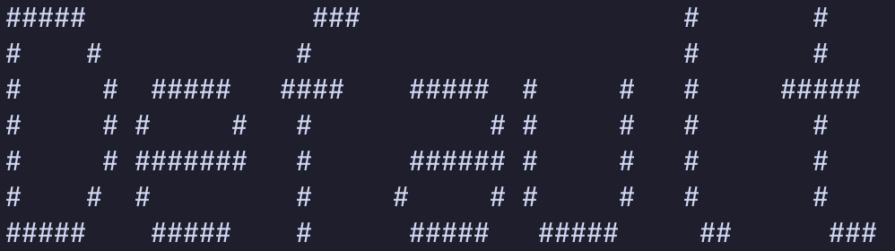
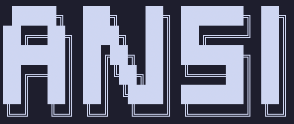
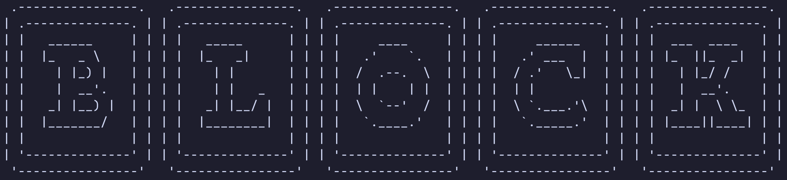
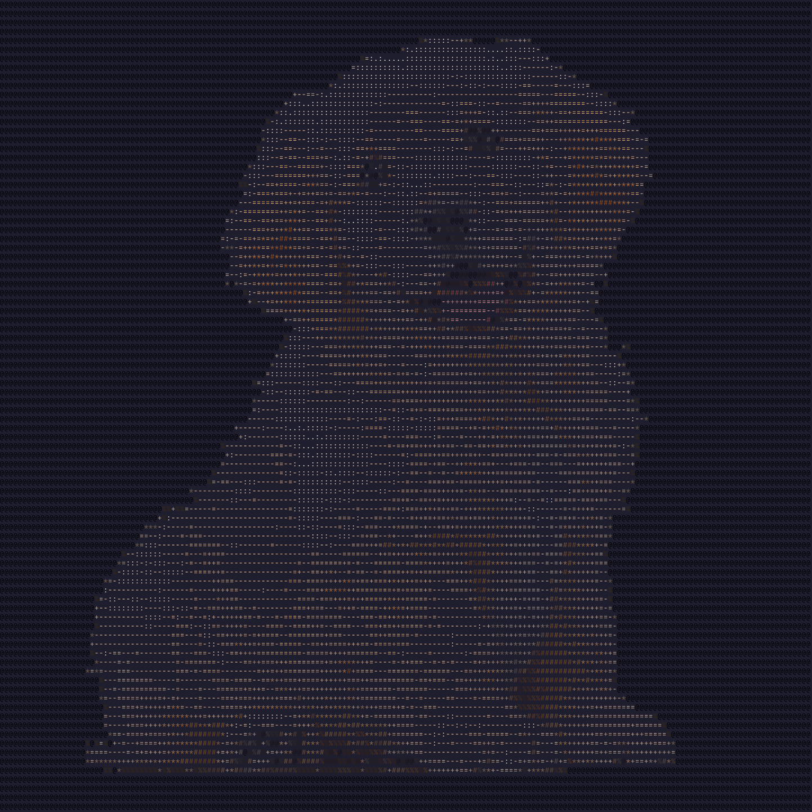

```
       █████╗  ███████╗  ██████╗ ██╗ ██╗           █████╗  ██████╗  ████████╗
      ██╔══██╗ ██╔════╝ ██╔════╝ ██║ ██║          ██╔══██╗ ██╔══██╗ ╚══██╔══╝
      ███████║ ███████╗ ██║      ██║ ██║          ███████║ ██████╔╝    ██║
      ██╔══██║ ╚════██║ ██║      ██║ ██║          ██╔══██║ ██╔══██╗    ██║
      ██║  ██║ ███████║ ╚██████╗ ██║ ██║          ██║  ██║ ██║  ██║    ██║
      ╚═╝  ╚═╝ ╚══════╝  ╚═════╝ ╚═╝ ╚═╝          ╚═╝  ╚═╝ ╚═╝  ╚═╝    ╚═╝

 ██████╗  ███████╗ ███╗   ██╗ ███████╗ ██████╗   █████╗  ████████╗  ██████╗  ██████╗
██╔════╝  ██╔════╝ ████╗  ██║ ██╔════╝ ██╔══██╗ ██╔══██╗ ╚══██╔══╝ ██╔═══██╗ ██╔══██╗
██║  ███╗ █████╗   ██╔██╗ ██║ █████╗   ██████╔╝ ███████║    ██║    ██║   ██║ ██████╔╝
██║   ██║ ██╔══╝   ██║╚██╗██║ ██╔══╝   ██╔══██╗ ██╔══██║    ██║    ██║   ██║ ██╔══██╗
╚██████╔╝ ███████╗ ██║ ╚████║ ███████╗ ██║  ██║ ██║  ██║    ██║    ╚██████╔╝ ██║  ██║
 ╚═════╝  ╚══════╝ ╚═╝  ╚═══╝ ╚══════╝ ╚═╝  ╚═╝ ╚═╝  ╚═╝    ╚═╝     ╚═════╝  ╚═╝  ╚═╝
 ```

## Build Instructions

Run "make"

Optional:  
Run `make clean` to delete all .o files  
Run `make cleaner` to delete all .o, .so/.dylib, and executable files

## Usage

Text to ascii art:  
`./bin/ascii_to_art <INPUT> [--font <FONT>] [--scale <N>]`

Image to ascii art: (will generate an `output.txt`)  
`./bin/image_to_art <FILE> [--scale <N>]`  
`cat output.txt` to view result (may have to zoom out CTRL + minus)

## Currently Available Fonts







## Image to Art Example



